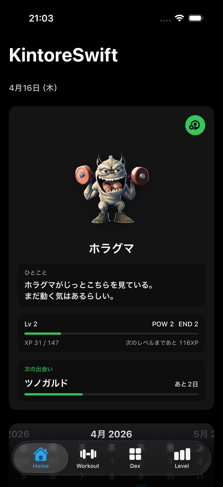
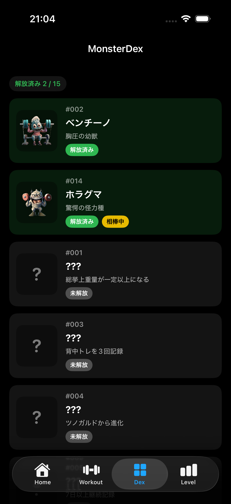
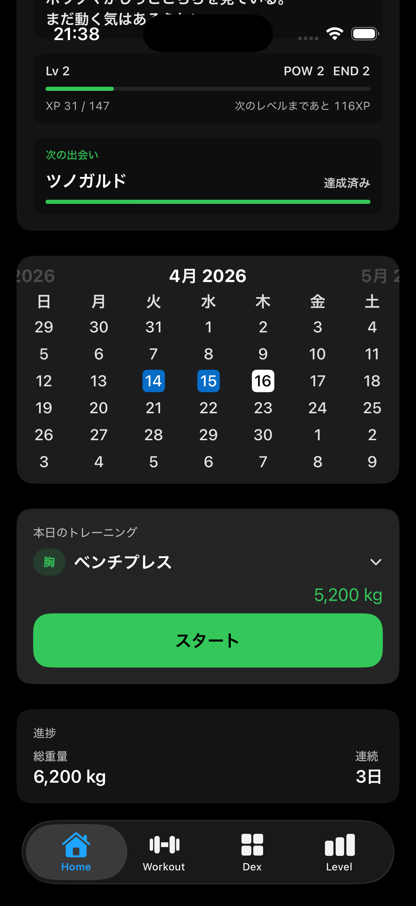
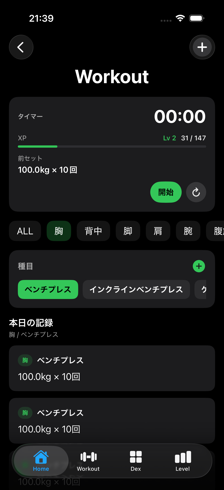
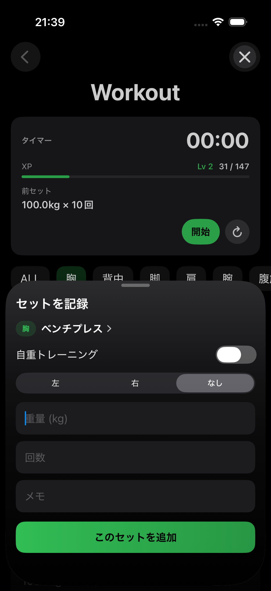
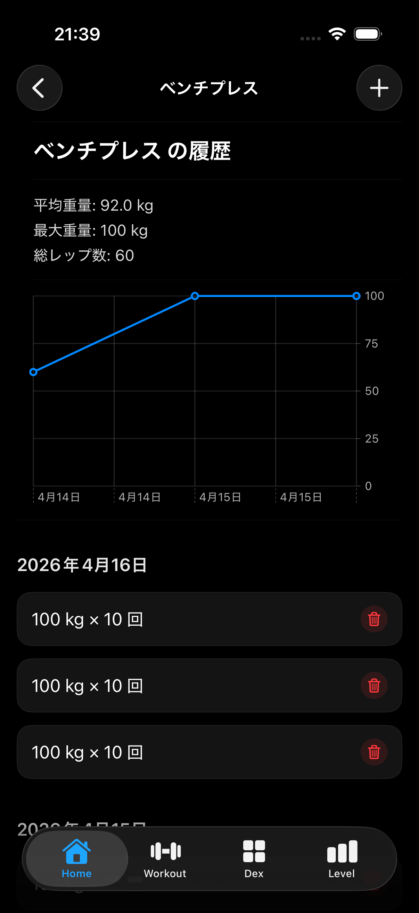

# 🏋️‍♂️ KintoreSwift

筋トレ × ゲーミフィケーションで、継続を楽しくするアプリ

**KintoreSwift** は、筋トレの記録と成長を可視化するためのiOSアプリです。  
シンプルなUIでトレーニング内容を記録し、データと演出でモチベーションを高めます。

---

## 🚀 最新アップデート

- 🧬 キャラクター進化システム実装（Lv15 / Lv30）
- ✨ 進化演出（アニメーション + 効果音）
- 🎮 XPシステム改善（自重トレ対応）
- 🧍 キャラクター表示の改善
- 📆 カレンダー常設

記録・育成・演出がつながるワークアウト体験に進化しています。

---

## 📱 スクリーンショット

モンスター育成とトレーニングが連動する、新しいワークアウト体験。

---

### 🏠 ホーム / 相棒モンスター

---

### 📘 モンスター図鑑

---

### 📅 カレンダー / トレーニング導線

---

### 🏋️ ワークアウト

---

### ✍️ セット入力

---

### 📈 成長グラフ

---

## ✨ 主な機能

- 📆 **カレンダー表示**：トレーニング実施日をハイライト
- 🎮 **キャラクター育成システム**
- 🧬 **進化システム**：レベルに応じて変化
- 🏋️‍♀️ **種目・部位別記録**：重量トレーニングと自重トレーニングの両方に対応
- 📊 **折れ線グラフ表示（Swift Charts）**：重量推移を日次・週次・月次で可視化
- 📖 **履歴画面統一表示**：HOME/Workout どちらからでも同じ履歴画面へ遷移
- ⏱ **通知対応ワークアウトタイマー**
- 🆙 **レベルアップ・進化演出**
- 🏷 **称号アンロック**：POWER / ENDURANCE の育成傾向に応じて称号を獲得
- 💪 **キャラクター育成**：レベル帯に応じて見た目と待機アニメーションが変化
- 🔄 **前回比の自動表示**
- 🗑 **スワイプ削除**

---

## 🎮 ゲーミフィケーション

- トレーニングでXPを獲得
- レベルアップでキャラクターが成長
- 進化システム（フツウ → ホソマッチョ → マッチョ）
- 進化演出（アニメーション + 効果音）
- 成長が視覚的にわかるUI

筋トレの継続を「ゲーム体験」として楽しめます。

---

## 🧩 使用技術

| 分類 | 技術 |
|------|------|
| フレームワーク | SwiftUI |
| データベース | SQLite |
| グラフ表示 | Swift Charts |
| 通知 | UserNotifications |
| 言語 | Swift 5 |
| 開発環境 | Xcode 16 / iOS 18 |

---

## 🧠 コンセプト

> 筋トレが、ゲームになる。

トレーニングの記録を「成長体験」に変えることで、  
継続しやすいワークアウトを実現します。

---

## 🔮 今後の予定

- ☁ iCloudバックアップ対応
- 🌍 多言語対応
