## KintoreSwift

モンスター育成とトレーニングが連動する、新しいワークアウト体験。

トレーニングを記録することでモンスターが成長し、
条件を満たすと新たなモンスターと出会える。

継続するほど世界が広がっていく、
“ゲームのような筋トレアプリ”。

---

## 🚀 最新アップデート

- 🧬 キャラクター進化システム実装（Lv15 / Lv30）
- ✨ 進化演出（アニメーション + 効果音）
- 🎮 XPシステム改善（自重トレ対応）
- 🧍 キャラクター表示の改善
- 📆 カレンダー常設

記録・育成・演出がつながるワークアウト体験に進化しています。

---

## 📱 スクリーンショット

モンスター育成とトレーニングが連動する、新しいワークアウト体験。

| ホーム | 図鑑 | カレンダー |
|--------|------|------------|
|  |  |  |

---

| ワークアウト | セット入力 | グラフ |
|--------------|------------|--------|
|  |  |  |

---

## 👾 モンスター一覧

| #001 バルグロン | #002 ベンチーノ | #003 デドリガン |
|---|---|---|
| 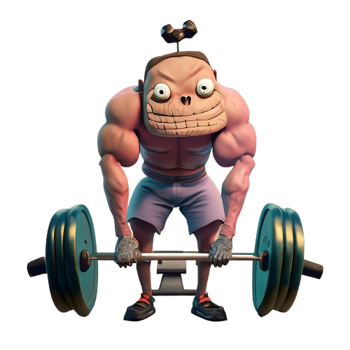 バルグロン | 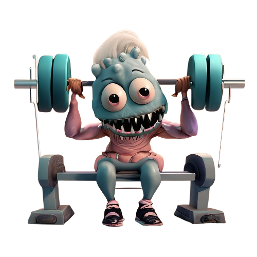 ベンチーノ | 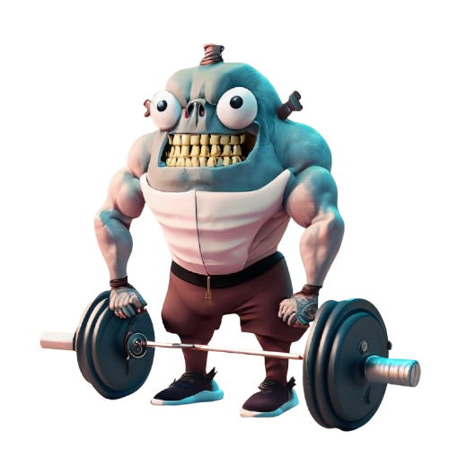 デドリガン |

| #004 ホーンラック | #005 ツノガルド | #006 モフリフト |
|---|---|---|
| 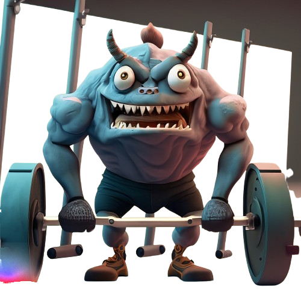 ホーンラック | 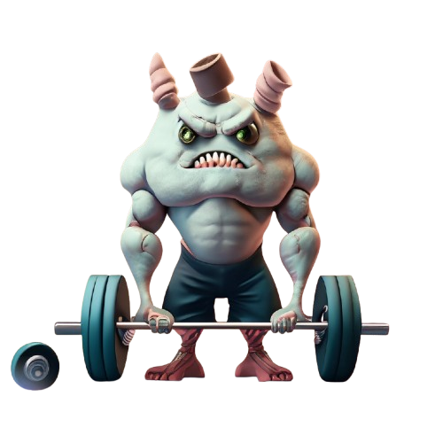 ツノガルド | 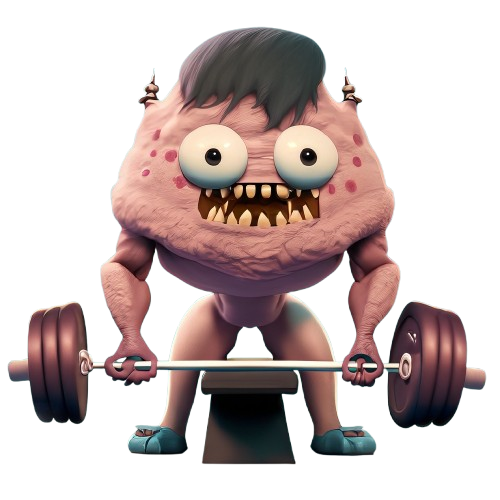 モフリフト |

| #007 クロウガル | #008 ガンマウス | #009 メガドラン |
|---|---|---|
| 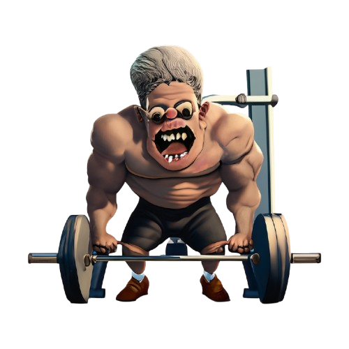 クロウガル | 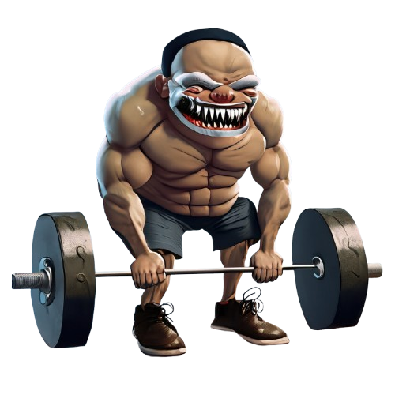 ガンマウス | 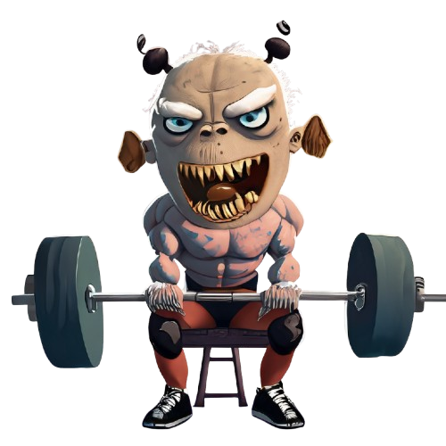 メガドラン |

| #010 ダンベルガ | #011 バルグロス | #012 ベンチザウル |
|---|---|---|
| 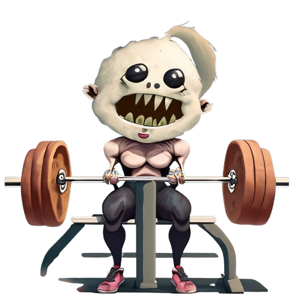 ダンベルガ | 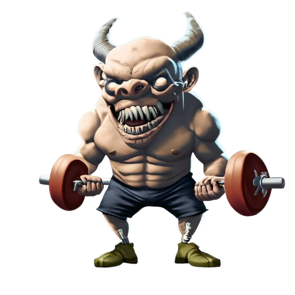 バルグロス | 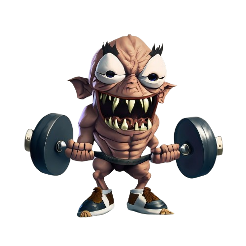 ベンチザウル |

| #013 デドレックス | #014 ホラグマ | #015 ギガマウス |
|---|---|---|
| 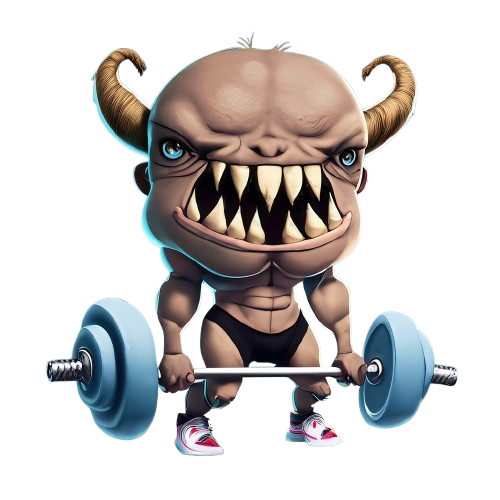 デドレックス | 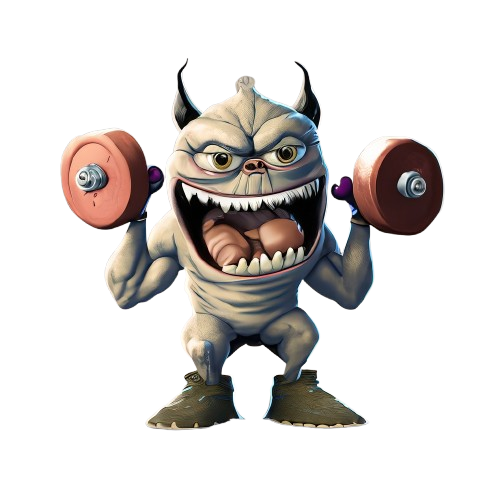 ホラグマ | 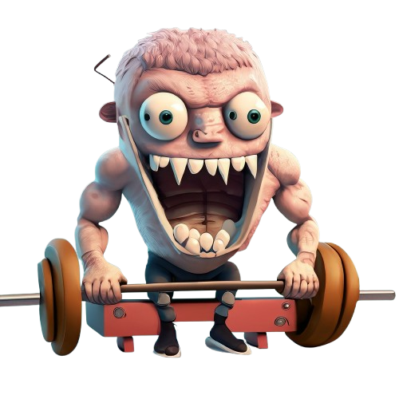 ギガマウス |

---

## ✨ 主な機能

- 🐲 モンスター育成  
  トレーニングに応じて相棒モンスターが成長

- 🔓 解放（アンロック）  
  特定条件を達成すると新たなモンスターが出現

- 🌱 進化システム  
  継続や成果に応じてモンスターが変化

- 📅 カレンダー連動  
  トレーニング履歴を日付単位で管理

- 🏋️ ワークアウト記録  
  種目・重量・回数をシンプルに記録

- 📈 成長の可視化  
  グラフや履歴でトレーニングの変化を確認

---

## 🎮 ゲーミフィケーション

- トレーニングでXPを獲得
- レベルアップでキャラクターが成長
- 進化システム（フツウ → ホソマッチョ → マッチョ）
- 進化演出（アニメーション + 効果音）
- 成長が視覚的にわかるUI

筋トレの継続を「ゲーム体験」として楽しめます。

---

## 🧩 使用技術

| 分類 | 技術 |
|------|------|
| フレームワーク | SwiftUI |
| データベース | SQLite |
| グラフ表示 | Swift Charts |
| 通知 | UserNotifications |
| 言語 | Swift 5 |
| 開発環境 | Xcode 16 / iOS 18 |

---

## 🧠 コンセプト

> 筋トレが、ゲームになる。

トレーニングの記録を「成長体験」に変えることで、  
継続しやすいワークアウトを実現します。

---

## 🔮 今後の予定

- ☁ iCloudバックアップ対応
- 🌍 多言語対応
