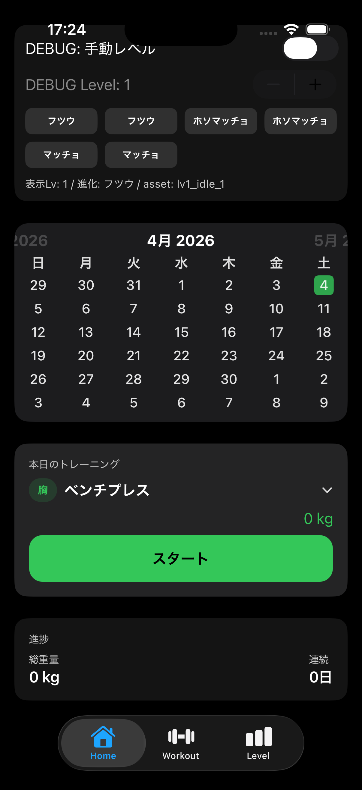

# 🏋️‍♂️ KintoreSwift

SwiftUI × Charts × FSCalendar で作る、筋トレ記録アプリ。  
日ごとのトレーニング内容を記録し、グラフやカレンダーで振り返ることができます。

---

## 📱 主な機能

- 🗓 **カレンダー表示（FSCalendar）**  
  記録がある日は青くマーク。日付をタップしてトレーニング履歴を確認。

- 💪 **部位・種目の切り替え**  
  「胸・背中・脚・肩・腕・腹筋」などのカテゴリから選択可能。

- 📊 **折れ線グラフ（Charts）**  
  日・週・月ごとに平均重量を集計して可視化。  
  進捗をひと目で確認できます。

- 🔁 **前回比の表示**  
  同じ種目の前回データと比較し、増減をわかりやすく表示。

- 🕓 **履歴画面（HistoryView）**  
  種目ごとの全セット記録を一覧化。  
  平均・最大重量、総レップ数も自動集計。

---

## 🧩 使用技術

| 分類 | 技術 |
|------|------|
| 言語 | Swift, SwiftUI |
| データベース | CoreData（または SQLite予定） |
| UIライブラリ | [FSCalendar](https://github.com/WenchaoD/FSCalendar) |
| グラフ描画 | [Swift Charts](https://developer.apple.com/documentation/charts) |
| 開発環境 | Xcode 16 / iOS 18 |

---

## 📷 スクリーンショット

| カレンダー画面 | 履歴画面 |
|----------------|-----------|
|  |  |

※ `screenshots/` フォルダに画像を追加して表示できます。

---

## 🚀 今後の予定

- [ ] 各種目ごとのPR（個別グラフ）追加  
- [ ] iCloud連携  
- [ ] ダークモード対応  
- [ ] データエクスポート（CSV）  
- [ ] キャラ育成モード（Kintoreキャラ成長）

