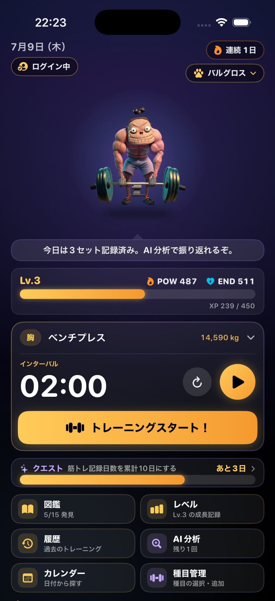
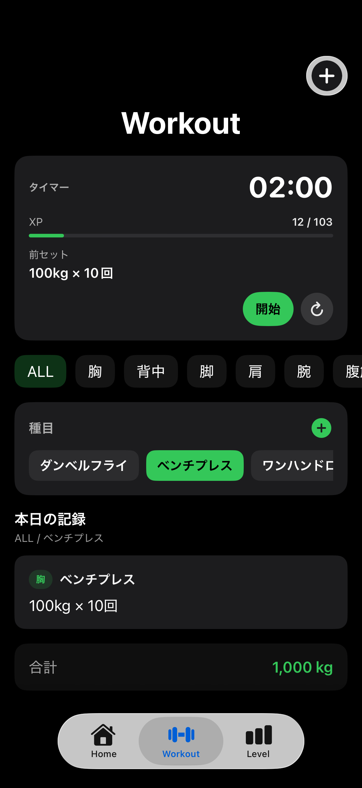
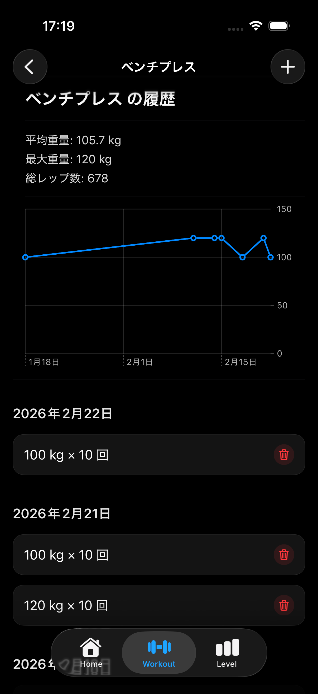

# 🏋️‍♂️ KintoreSwift

**KintoreSwift** は、筋トレの記録と成長を可視化するためのiOSアプリです。  
シンプルなUIでトレーニング内容を記録し、データと演出でモチベーションを高めます。

---

## 🚀 v0.6.0 アップデート

- 🔔 タイマーをローカル通知対応（バックグラウンド・スリープ継続）
- 📖 履歴UIを統一し、HOME/Workoutどちらからも同一表示
- ✨ レベルアップ演出を強化（表示時間延長）
- 📆 HOME画面にカレンダー常設

ワークアウト体験の一体感を強化したバージョンです。

---

## 📱 スクリーンショット

| ホーム | 履歴 | グラフ |
|--------|------|--------|
|  |  |  |

※ スクリーンショットは `KintoreSwift/screenshots/` に配置してください。

---

## ✨ 主な機能

- 📆 **カレンダー表示**：トレーニング実施日をハイライト
- 🏋️‍♀️ **種目・部位別記録**
- 📊 **折れ線グラフ表示（Swift Charts）**
- 📖 **履歴画面統一表示**
- ⏱ **通知対応ワークアウトタイマー**
- 🆙 **レベルアップ演出**
- 🔄 **前回比の自動表示**
- 🗑 **スワイプ削除**

---

## 🎮 ゲーミフィケーション

- トレーニング記録でXP加算
- レベルアップオーバーレイ演出
- 今後キャラクター成長と連動予定

---

## 🧩 使用技術

| 分類 | 技術 |
|------|------|
| フレームワーク | SwiftUI |
| データベース | SQLite |
| グラフ表示 | Swift Charts |
| 通知 | UserNotifications |
| 言語 | Swift 5 |
| 開発環境 | Xcode 16 / iOS 18 |

---

## 🗂 ディレクトリ構成

