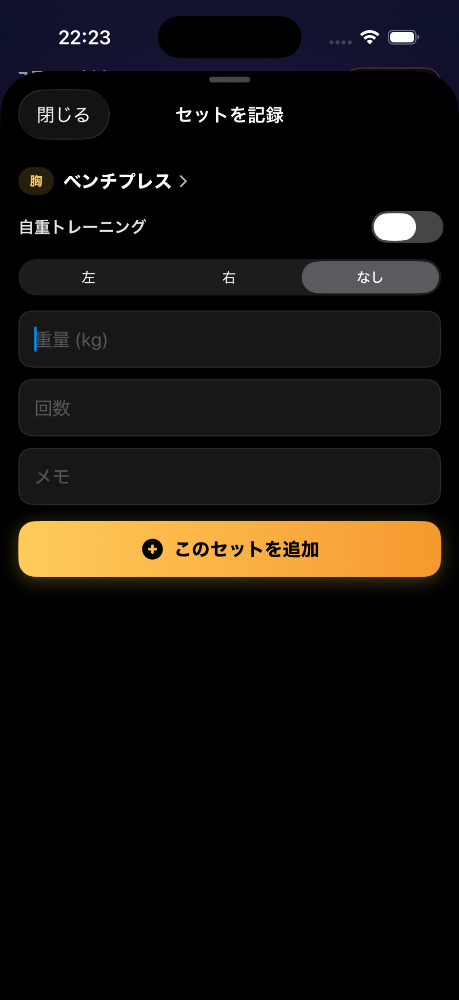
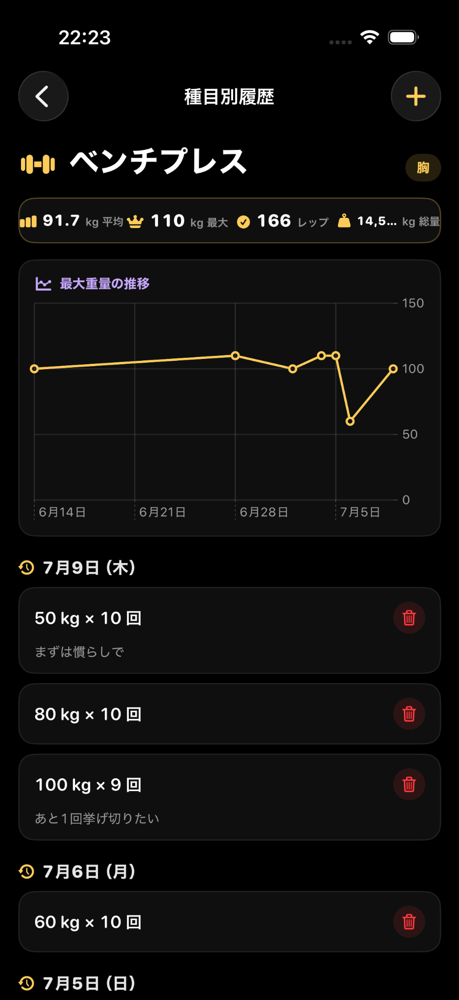
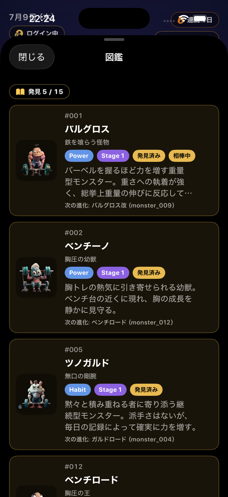
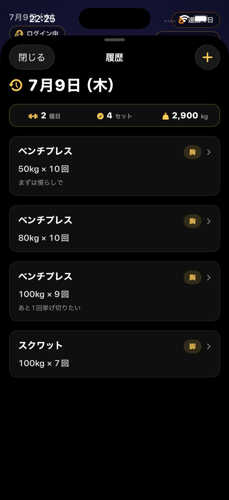
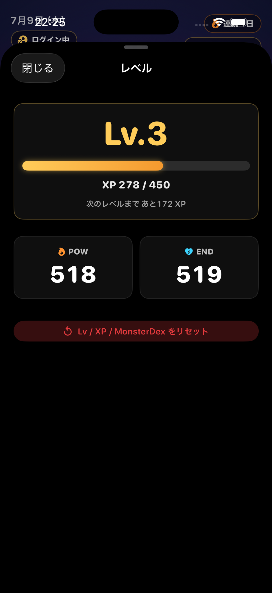
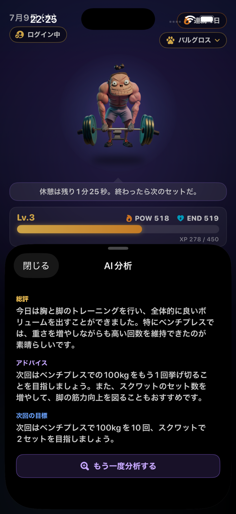
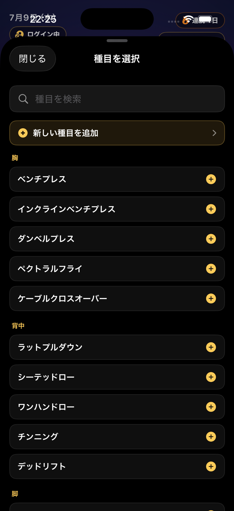

# KintoreSwift

**筋トレを、ゲームのように続ける。**

KintoreSwiftは、トレーニング記録・モンスター育成・レベル成長・AI分析を組み合わせた、SwiftUI製のワークアウトアプリです。

重量や回数を記録するだけでなく、日々のトレーニングがXP・レベル・POW・END・モンスター図鑑に反映されます。
さらにAI分析によって、その日のトレーニング内容を振り返り、次回の目標まで確認できます。

筋トレの継続を「記録」ではなく「成長体験」に変えることを目指しています。

---

## 🧠 Concept

筋トレは、成果が見えるまでに時間がかかります。

だからこそ、毎日の小さな積み上げを見える化し、続けたくなる仕組みが必要です。

KintoreSwiftでは、トレーニングを記録するたびにXPが増え、相棒モンスターが成長します。
履歴やグラフで自分の成長を確認し、AI分析で次回のトレーニングにつながるフィードバックを受け取れます。

> 現実の努力が、仮想空間の冒険になる。

---

## 📱 Screenshots

<table>
  <tr>
    <th>ホーム</th>
    <th>セット記録</th>
    <th>種目別履歴</th>
    <th>図鑑</th>
  </tr>
  <tr>
    <td></td>
    <td></td>
    <td></td>
    <td></td>
  </tr>
  <tr>
    <th>履歴</th>
    <th>レベル</th>
    <th>AI分析</th>
    <th>種目選択</th>
  </tr>
  <tr>
    <td></td>
    <td></td>
    <td></td>
    <td></td>
  </tr>
</table>

---

## ✨ Features

### 🏋️ トレーニング記録

種目・重量・回数・メモをシンプルに記録できます。

- 重量 / 回数 / メモ
- 自重トレーニング
- 左右別記録
- 種目選択・新規種目追加

記録した内容は、履歴・グラフ・XP・ステータス・AI分析に反映されます。

### 🏠 ゲーム風ホーム

ホーム画面では、今日のトレーニング状況・相棒モンスター・レベル・XP・POW・ENDをひと目で確認できます。

主要機能へすぐアクセスできるように、以下の導線を配置しています。

- トレーニング開始
- AI分析
- 履歴 / カレンダー
- 種目管理
- 図鑑
- レベル確認

### 📈 履歴 / グラフ

日別履歴と種目別履歴に対応しています。

種目別履歴では以下を確認できます。

- 平均重量 / 最大重量 / 合計レップ数 / 総重量
- 最大重量の推移グラフ
- 過去セット一覧とメモ

自分がどの種目でどれだけ成長しているかを振り返ることができます。

---

## 🤖 AI Analysis

その日のトレーニング内容をもとに、AIがフィードバックを返します。

| 項目 | 内容 |
|---|---|
| 総評 | その日のトレーニング全体のまとめ |
| アドバイス | 記録内容に基づく具体的な改善提案 |
| 次回の目標 | 次のトレーニングで目指す数値 |

記録して終わりではなく、次のトレーニングにつながる振り返りを行えるようにしています。

---

## 🎮 Gamification

### レベル / XP / ステータス

トレーニングを記録するとXPを獲得し、レベルが上がります。

- **POW**: パワー系の成長指標
- **END**: 継続・持久力系の成長指標

筋トレの積み上げを、ゲームのステータスのように確認できます。

### モンスター育成

トレーニングの継続や条件達成によって、モンスターが解放されます。

モンスターには名前・タイプ・Stage・説明文・進化先があり、図鑑で確認できます。
お気に入りのモンスターを相棒に設定し、一緒に成長していく体験を作っています。

👾 モンスター一覧を見る（全15体）

| #001 バルグロン | #002 ベンチーノ | #003 デドリガン |
|---|---|---|
|  バルグロン |  ベンチーノ |  デドリガン |

| #004 ホーンラック | #005 ツノガルド | #006 モフリフト |
|---|---|---|
|  ホーンラック |  ツノガルド |  モフリフト |

| #007 クロウガル | #008 ガンマウス | #009 メガドラン |
|---|---|---|
|  クロウガル |  ガンマウス |  メガドラン |

| #010 ダンベルガ | #011 バルグロス | #012 ベンチザウル |
|---|---|---|
|  ダンベルガ |  バルグロス |  ベンチザウル |

| #013 デドレックス | #014 ホラグマ | #015 ギガマウス |
|---|---|---|
|  デドレックス |  ホラグマ |  ギガマウス |

---

## 🧩 Tech Stack

| Category | Technology |
|---|---|
| iOS | Swift / SwiftUI |
| Local Database | SQLite |
| Charts | Swift Charts |
| Calendar | FSCalendar |
| Notification / Sound | UserNotifications / AVAudio |
| Backend | Django / Django REST Framework |
| AI | OpenAI API |
| Database | PostgreSQL / Neon |
| Deployment | Render |
| Version Control | Git / GitHub |

---

## 🏗 Architecture

KintoreSwiftは、iOSアプリとDjangoバックエンドを組み合わせた構成です。

- **iOSアプリ**: トレーニング記録・履歴表示・モンスター育成・UI表示を担当
- **Djangoバックエンド**: AI分析やユーザー認証など、APIキーやユーザーデータを安全に扱う必要がある処理を担当

OpenAI APIはアプリから直接呼び出さず、Djangoバックエンドを経由する構成にしています。

---

## 🔮 Roadmap

今後は以下の機能改善を予定しています。

- App Store公開準備
- 本番メール送信設定
- AI分析の精度改善
- プレミアムプラン設計
- クラウド同期
- SNS共有用カード
- Apple Watch連携
- クエスト機能の拡張
- モンスター進化演出の強化
- トレーニングメニュー提案

---

## 👤 Developer

KintoreSwiftは、筋トレを継続するための「成長が見える体験」をテーマに開発している個人開発アプリです。

記録が面倒な作業で終わらないように、ゲーム性・キャラクター・AI分析を組み合わせています。
筋トレを続ける人にとって、毎日の記録が少し楽しみになるアプリを目指しています。
